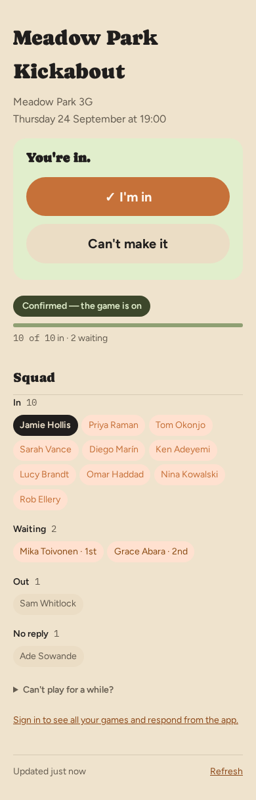
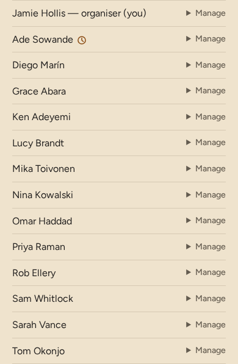
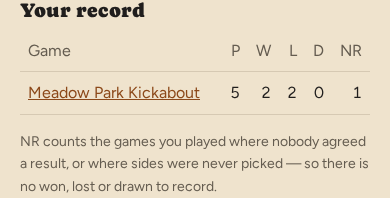

# Design system

What the app's visual system *is* today, read from source. The source of truth is the code:
tokens in the `STYLES` block of `src/views/layout.ts`, components in the exported blocks of
`src/views/styles.ts`. When this page and the code disagree, the code wins and this page is
wrong — fix it in the same commit.

Current as of 23 September 2026 (after M66).

## Character

Warm, plain and a little expressive. A cream ground, a burnt-orange accent, a chunky display
face for page titles, and big pill-shaped buttons a thumb can't miss. It is built for a phone
held in one hand on the way to a pitch, and for people who answer one email a week.

## Tokens

All colour comes from custom properties on `:root`. Dark mode is `prefers-color-scheme: dark`
swapping the same names; there is no manual theme switch.

### Colour

| Token | Light | Dark | Use |
|---|---|---|---|
| `--bg` | `#efe3cd` | `#221f1b` | Page ground |
| `--card` | `#f5ead8` | `#2b2721` | Bordered secondary surfaces — workspaces, tiles, the jump-to index |
| `--card-raised` | `#f9f4ed` | `#322d26` | Borderless raised cards — fixture cards, the answer block, panels |
| `--field` | `#ebddc5` | `#3a342b` | Default button fill, inputs, segment tracks, muted badges |
| `--fg` | `#201e1d` | `#ede5d8` | Body text; also the "inverted" fill for a selected chip or side |
| `--mut` | `#645c50` | `#a89e8f` | Default paragraph colour, support text, captions |
| `--line` | `#d6c9b3` | `#3a352d` | Every 1px rule and border |
| `--accent` | `#c67139` (`THEME_COLOR`) | `#d98a55` | Primary buttons, focus rings, the current-nav underline |
| `--accent-fg` | `#fff7f0` | `#2a1608` | Text on an accent fill |
| `--accent-mut` | `#ffe1d0` | `#3a2818` | Soft accent ground — "in" chips, your row in Standings |
| `--link` | `#8c491a` | `#e0a878` | Links |
| `--ok` / `--ok-bg` / `--ok-fg` | `#8fa073` / `#e1eecc` / `#3d472b` | `#a3b585` / `#2c3320` / `#cfe0b0` | Settled, going ahead, confirmed |
| `--warn` / `--warn-bg` | `#8a4c14` / `#ffe1d0` | `#f0b285` / `#43301f` | Needs attention, waitlist, errors |
| `--wait` / `--wait-fg` | `#f6a06b` / `#402310` | same | Short capacity, waiting |
| `--danger` / `--danger-fg` | `#a4321f` / `#fbfaf8` | `#e8705a` / `#1a0d0a` | Irreversible actions only |

| `--side-a` / `--side-a-bg` / `--side-a-fg` | `#4a6a8f` / `#dde5ee` / `#2c4560` | `#7d9cc0` / `#26303b` / `#b8cbe0` | Team side A (slate): dot, tile ground, text. Never a status |
| `--side-b` / `--side-b-bg` / `--side-b-fg` | `#8a4a78` / `#efdfe9` / `#5f2f52` | `#b77ca5` / `#3a2934` / `#e3bfd6` | Team side B (plum) |
| `--danger-bg` | `#f6dcd5` | `#3d1f19` | Tint behind danger text — the cancelled badge |

`THEME_COLOR` also feeds the `theme-color` meta tag and the web manifest. Contrast floors for
the important pairs, in both themes, are enforced by `test/views/contrast.test.ts`.

### Type

| Role | Face | Size token | Notes |
|---|---|---|---|
| Page title (`h1`) | Caprasimo 400 | `--t-title` 2rem | Display face |
| Section heading (`h2`) | Caprasimo 400 | `--t-lead` 1.25rem | Display face; 2rem above |
| Body | Figtree 400 | `--t-body` 1rem | Line height 1.6 |
| Support, captions, hints | Figtree | `--t-support` 0.875rem | The most used size |
| Counts, links to copy, team letters | IBM Plex Mono 400/500 | — | `--mono` |

Four sizes and no others: `test/views/layout.test.ts` fails any `font-size` that is not a
`var(--t-*)`. Fonts load from Google Fonts with `display=swap`; the CSP allows exactly
`fonts.googleapis.com` and `fonts.gstatic.com`. There is no global `h3` style — each
component sets its own.

### Space, shape, layout

| Token | Value | | Token | Value |
|---|---|---|---|---|
| `--s-1` | 0.5rem (8px) | | `--r-pill` | 999px — buttons, chips, badges, segments |
| `--s-2` | 0.75rem (12px) | | `--r-card` | 1.25rem — raised cards |
| `--s-3` | 1rem (16px) | | `--r-field` | 0.75rem — fields, tiles |
| `--s-4` | 1.5rem (24px) | | | |
| `--s-5` | 2rem (32px) | | | |
| `--s-6` | 2.5rem (40px) | | | |

`test/views/design-lint.test.ts` holds every margin, padding, gap and radius to these tokens
(M67).

- **Column:** `main` is 30rem; form and privacy pages widen it to 40rem; `WIDE_COLUMN_CSS`
  takes it to 52rem at ≥64rem. Body padding 2rem 1.25rem.
- **Spacing:** no token. The recurring vertical rhythm is 1.25 / 1.5 / 2 / 2.5rem.
- **Radii:** `999px` for every pill (buttons, chips, badges, segments); 1.25rem for raised
  cards; 0.75rem for fields. (Nineteen distinct values exist in practice — see
  [UI standards](ui-standards.md#where-the-app-does-not-meet-them-yet).)
- **Borders:** `1px solid var(--line)`, nearly everywhere.
- **Shadow:** one — the update toast. Everything else is flat.
- **Breakpoints:** `min-width: 30rem` (answer buttons go side by side), `max-width: 40rem`
  (team picker, notification cards and Standings adapt), `min-width: 64rem` (wide column).

## Components

**One selected state.** Anything the viewer chose — an answer, a pressed segment, a picked
side, their own chip — is `--fg` fill with `--card-raised` text. Anything not chosen sits on
`--field`. The accent fill is reserved for the one committing action on a screen.

Each lives in a named, exported style block in `src/views/styles.ts` (or `STYLES` in
`layout.ts` for the global ones). A page only gets a block it lists in its `pageStyles`.

| Component | Classes | Block | What it is |
|---|---|---|---|
| Button | `.button` | `STYLES` | Full-width pill, 52px tall, `--field` fill, bold lead-size label |
| — primary | `.button.primary` | `STYLES` | Accent fill. The one committing action in a task |
| — danger | `.button.danger` | `STYLES` | Danger fill. Irreversible actions only |
| — back out | `.keep-link` | `CANCEL_STYLES_CSS` | The "No, keep it" link on a confirmation page, shaped as a button |
| — answer states | `.expected`, `.chosen-in`, `.chosen-waiting`, `.chosen-out`, `.quiet` | `FIXTURE_STYLES_CSS` | Unanswered: "I'm in" is accent-filled (`.expected`). Answered: the chosen button takes the selected state, with its tick, cross or waiting label |
| Answer block | `.answer` (`-going`, `-waiting`, `-closed`), `.viewer-headline`, `.responses` | `FIXTURE_STYLES_CSS` | The tinted card holding "You're in." and the two buttons |
| Status badge | `.status-badge.status-{confirmed,short,cancelled,open,played,scheduled}` | `FIXTURE_STYLES_CSS` | Pill naming a fixture's state in words |
| Capacity bar | `.capacity .track .fill .count` | `FIXTURE_STYLES_CSS` | 6px groove plus "10 of 10 in · 2 waiting"; width from generated `.w-0`…`.w-100` classes |
| Chips | `.chip-{in,waitlisted,out,pending}`, `.chip-you` | `SQUAD_STYLES_CSS` | The squad as grouped pills on player pages; you are inverted |
| Squad rows | `ul.squad > li`, `.row-controls`, `.member-actions` | `FORM_CSS` (wins over `SQUAD_STYLES_CSS`) | The organiser's squad list: name left, controls right |
| Segmented control | `.segment .seg` (`.on`, `.out`), `.teams .sides` | `FORM_CSS`, `TEAM_PICKER_CSS` | In/Out per member, and A/B per player on the picker: a `--field` pill track of 44px segments; the pressed one takes the selected state. The picker's "—" (clear) never fills |
| Fixture card | `.fixture-list .fixture-card` | `DASHBOARD_STYLES_CSS` | One upcoming or past fixture on the dashboard, account and past-fixtures pages |
| Form field | `.field` (+ `.error`, `.field-invalid`), `.row`, `.actions` | `FORM_CSS` | Label above input; `--field` ground, 1px line, 0.75rem radius |
| Switch row | `.switch-row` + `.hint` | `FORM_CSS` | A checkbox with a label and a hint beneath, 52px |
| Notices | `.nudge` (`.ok`), `.problem`, `.form-error`, `.read-only` | various | Attention box, error box, and a quiet "this can't be changed" box |
| Jump-to index | `.fixture-index`, `.fixture-section` | `FIXTURE_STYLES_CSS` | The link strip at the top of the organiser's fixture page |
| Workspaces | `.team-workspace`, `.timeline-workspace`, `.result-workspace` | own blocks | A contained task on a long page |
| Result panel | `.result-focus`, `.result-candidate`, `.result-alternate` | `RESULT_CSS` | The result so far, its backers, and the other-result form |
| Tables | `table.record`, `table.league`, `table.notify-matrix` | `RECORD_CSS`, `LEAGUE_CSS`, `NOTIFY_MATRIX_CSS` | Your record; Standings (sticky columns, sortable); notification settings (cards on a phone) |
| Freshness bar | `.freshness`, `.freshness-refresh` | `FRESHNESS_CSS` | "Updated just now · Refresh" at the foot of live pages |
| Site header | `.site-header`, `nav a[aria-current=page]` | `STYLES` | Signed-in pages only |
| Disclosure | `details > summary`, `.qr-toggle` | `FORM_CSS`, `INVITE_CSS` | Secondary tools, collapsed |

## How styling is wired, and the rules the code enforces

These are not preferences; breaking them fails a test or silently breaks production.

- **Every `<style>` block must be registered.** `src/security/csp.ts` hashes exactly
  `STYLE_BLOCKS` into `style-src`. An unregistered block is dropped by the browser in
  production and every test still passes. `layout()`'s `pageStyles` is typed so an
  unregistered block fails to compile.
- **No `style="…"` attributes, ever.** The CSP is hash-only with no `style-src-attr`; an
  attribute is stripped. Use a class. Never add `'unsafe-inline'` or `'unsafe-hashes'`.
- **`pageStyles` order is cascade order.** `test/views/style-cascade.test.ts` fails on two
  blocks declaring the same selector unless one is named the intended winner and listed last.
  It cannot see two blocks styling one element through *different* selectors.
- **Font sizes come from the four `--t-*` tokens** (`test/views/layout.test.ts`).
- **Status badges draw from fixed token families** (`test/views/status-palette.test.ts`), and
  `status-short` must never look identical to `status-open`.
- **Contrast floors** for token pairs in both themes (`test/views/contrast.test.ts`).
- **A backtick inside a CSS comment in `styles.ts` ends the template literal**, and **comments
  in a style block ship to the browser** — don't quote UI copy in them.

Email templates (`src/notify/templates/`) are outside the page CSP and inline the light
palette as literal hex. They are copies of these tokens and can drift.
