# Information architecture

Every screen in Make The Team: who reaches it, how, what is on it, and why it is shaped that
way. Current as of 23 September 2026 (after M66). It replaces `screens.md`, which stopped at
M52; that file, with its milestone-by-milestone history, is in `docs/history/`.

The machine-checked list of every page is `test/browser/catalogue.ts` — the browser suite
fails if a page exists that it does not name. When this document and the catalogue disagree
about *which pages exist*, the catalogue is right.

A server-rendered web app (Cloudflare Workers + Hono, HTML forms, light script) that runs a
recurring casual fixture — a weekly kickabout. One organiser sets a game up once; fixtures
generate themselves week after week; players answer a reminder email and never need an
account.

## Audiences

| Audience | How they arrive | Identity |
|---|---|---|
| **Player (token)** — the default, highest-volume user | A link in an email | None. A signed URL token *is* the identity |
| **Player (signed in)** — for people who look rather than wait | Emailed magic link or passkey | Session cookie |
| **Organiser** — a signed-in player who owns a game | The signed-in area | Session, plus ownership re-checked in every handler |
| **Delegate** — a squad member handed one fixture's team pick (M29, M66) | Hand-over email, or their fixture page | Session, plus the fixture's hand-over re-checked |
| **Admin** — the operator | `Admin` in the signed-in header | Session, plus `is_admin` re-checked in every handler |

An entitlement refusal is always a 404, never a 403: a page must not confirm that something
exists to someone not allowed to see it.

## Navigation model

- **The site header** is on every signed-in page: `Make The Team` (to `/app`), then `Games`,
  `Account`, and `Admin` for admins only. The current section carries `aria-current`: every
  `/g/*` page is `Games`; account, passkeys and delete are `Account`.
- **Token and public pages have no header** — `/`, `/privacy`, `/sign-in`,
  `/sign-in/complete`, `/j/`, `/join/`, `/leave/`, `/cancel/`, `/offline`, the error pages.
  Their visitors often hold no session, and a `Games` link that bounces to sign-in is worse
  than none. **The one exception is `/r/:token`**, which shows the header when the visitor
  happens to be signed in, and otherwise ends with "Sign in to see all your games and respond
  from the app." — never both.
- **No breadcrumbs.** Depth is three or four levels: dashboard → game → fixture →
  teams / message / history / add a guest.
- **Back-links.** A page *below* a fixture or game ends in one text back-link: "Back to the
  fixture" (picker page, add a guest, what has happened), "Back to the game" (organiser
  fixture, past fixtures, invite order), "Back" (message the squad). Top-level pages — the
  dashboard, account, both game renderings, the player's fixture page, admin pages — have none;
  the header does that job.
- **Jump to.** The organiser's fixture page, the longest in the product, opens with a
  `Jump to` strip: `Squad`, `Teams`, `Messages and history`.
- **Wide column.** Above 64rem the organiser's fixture page and the picker page widen to 52rem;
  everything else stays a phone-width column.

```
/                         holding page ── Sign in
/sign-in                  ─► /app
/j/:token (invite)        ─► /join/:jtoken (confirm) ─► /app

email ─► /r/:token        answer a fixture
      ─► /leave/:token    leave a game
      ─► /cancel/:token   call a fixture off (organiser)

/app                      Your games (dashboard)
├─ /app/account           name, signing in, this device, recent fixtures
│  ├─ /app/passkeys
│  └─ /app/delete
├─ /g/new                 set up a game
├─ /g/:id                 a game (organiser or player rendering)
│  ├─ /g/:id/edit ─► /g/:id/archive
│  ├─ /g/:id/invites      invite order          /g/:id/invite/rotate
│  ├─ /g/:id/message      message everyone
│  ├─ /g/:id/fixtures     past fixtures
│  ├─ /g/:id/squad/:player ─► …/remove
│  └─ /g/:id/f/:fixture   a fixture (organiser or player rendering)
│     ├─ …/teams          team picker page (delegate, or organiser)
│     ├─ …/guest/add      add a guest
│     ├─ …/message        message the squad for this fixture
│     └─ …/timeline       what has happened
└─ /app/admin             allow list · sign-in doctor · delivery · usage · notifications
```

---

## 1. Public and token pages

### 1.1 Holding page — `GET /`
`Make The Team` (h1), a primary `Sign in` button, and a plain `Privacy` link. Deliberately not
personalised: the sign-in link never becomes "your dashboard", and `/sign-in` bounces a
signed-in visitor onward instead. No marketing and no explanation of the product.

### 1.2 Sign in — `GET/POST /sign-in`
- `Sign in` (h1), "We'll email you a link that signs you in. Nothing to remember, nothing to
  set up.", one email field, `Email me a sign-in link` (primary), and `Sign in with a passkey`
  under "Already added a passkey to this account?".
- The primary button disables itself and reads `Sending your link…` while the request is in
  flight (script only).
- **Success:** `Check your inbox` — "If that address can sign in, a link is on its way." It
  never says whether the address exists.
- **Inside the installed app** the passkey block moves above the form and becomes primary: on
  iOS an emailed link signs Safari in, not the app.

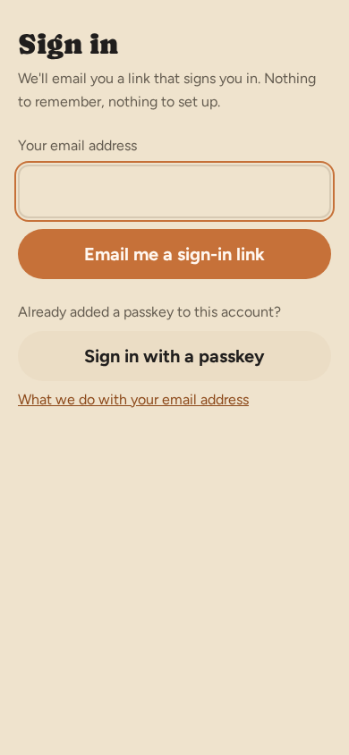

### 1.3 Sign-in failed — `GET /sign-in/complete`
One page for the four dead ends: `We can't sign you in`, a reason line, a sign-out button, and
"Back to Make The Team". Only the concurrent-write case offers `Try again`.

### 1.4 Join a game — `GET/POST /j/:token`
The public invite page; the one token handed to a whole squad, so it has its own larger rate
limit.
- `Join <game>` (h1); venue, address, cadence and kickoff, min–max players, `Next up: <date>`.
- A signed-in member of this squad sees a banner above the h1 — "You're already in this squad,
  signed in as <email>." — with a primary `Go to the game`; the join button drops to plain.
- `Join the squad` form: name and email. **Below** it, `Who's playing (N)` — first names and
  an initial — because it's what a person reads while deciding, not something to scroll past.
- Submitting from an address the app has never confirmed sends one email and shows
  `Check your inbox` (1.4a). A known address is seated immediately.
- A dead or replaced link answers the 404 "We can't find that page" (1.8).

### 1.4a Confirm a join — `GET/POST /join/:jtoken`
`Join the squad as <Name>?`, the game and venue, one `Yes, join the squad` button, and "Not you?
Just close this page". The GET writes nothing; the POST creates the membership and proves the
address. Once per address, ever.

### 1.5 Respond to a fixture — `GET/POST /r/:token`
**The most-used screen in the product.** The reminder and promotion emails carry one link —
`Respond on Make The Team`, or `See the game` once confirmed (M65) — and the tap *on this page*
is what saves.

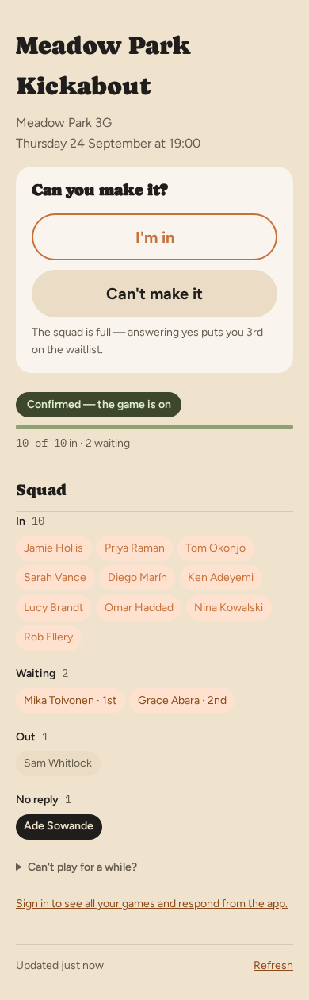

- **Order:** game (h1); venue; kickoff; the **answer block**; status badge and capacity bar;
  uneven and over-capacity notices; push offer; `Teams`; `Squad`; auto-decline; the sign-in
  line (no session only); freshness bar.
- **The answer block** is one tinted card: the headline, the two buttons, and any warning.
  Headlines: `Can you make it?`, `You're in.`, `You're on the waitlist — 3rd in line.`,
  `You said you can't make it.`, `You're in line — your group is due to be asked Wed 30 Sep, 10:00.`; closed
  states `You were in.`, `You were in before it was cancelled.`, `You said you couldn't make
  it.` and so on.
- **Four button states, tellable apart without colour:** unanswered `I'm in` has an accent
  outline; chosen-in is accent fill with a tick; waiting is amber `I'm in · waiting`; chosen-out
  is the inverted fill with a ✕.
- **Change guard (M65).** Reversing your own answer within 20 seconds does not write. The block
  becomes "You said you're in a moment ago. Change that to can't make it?" with
  `Yes, I can't make it` and `No, keep me in`. The same guard appears on the dashboard card and
  the player's game page.
- **Before any tap when full:** "The squad is full — answering yes puts you 3rd on the
  waitlist."
- **Teams**, once published: "You're on Bibs." — your own side always, even in a hidden squad.
- **Squad:** with visibility on, chips grouped `In`, `Waiting` (with rank), `Out`, `No reply`,
  your own chip inverted; attribution as one sentence per group ("Sam and Jo were marked in by
  Jamie."). With visibility off: "Who's playing isn't shown for this game. N in so far."
- **Push offer:** `Get these on your phone` and a permission button — never a device list.

### 1.6 Leave a game — `GET/POST /leave/:token`
From the footer of every squad email. `Leave <game>?`, what leaving means, "Changed your mind?
Just close this page", and `Leave this game` (danger). An organiser is warned they lose that
role; a sole organiser is refused. `Your other squads` follows — a list with its own `Leave`
buttons when signed in, a sign-in link otherwise.

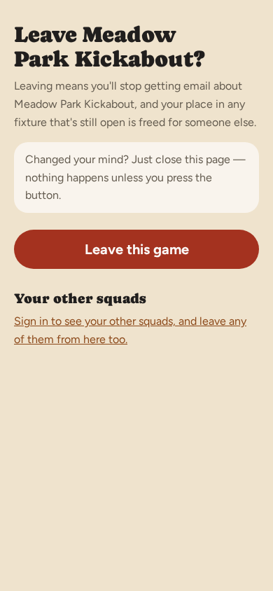

### 1.7 Call a fixture off — `GET/POST /cancel/:token`
Reached only from the organiser's short-of-players email. `<date> won't be played`, the
headcount and how many will be emailed, "Every other week carries on as normal.", "This can't
be undone…", an optional reason ("Pitch flooded"), `Call it off and email N people` (danger)
and `Keep the game on`. The done state carries the `Post to WhatsApp` card.

### 1.8 Utility and error pages
- `/privacy` — content page. `/offline` — `No connection`, from the service worker; shows
  nothing cached because fixture state goes stale at once.
- **`This link isn't working`** — every personal-token failure (`/r`, `/leave`, `/cancel`) and
  every unhandled error. It offers a sign-in for people with an account.
- **`We can't find that page`** (404) — a dead invite or join link, a `/g/*` refusal, a write
  to an archived game. "This link may be for a game you're not in, or you may be signed in
  with a different email…"
- **`Too many requests`** (429) — a token link used too often in a minute.
- An unrouted path gets a bare "Not found".

## 2. Signed-in player

### 2.1 Your games — `GET/POST /app`
The signed-in home and a to-do list, in this order:
- `Your games` (h1), "Signed in as <name>.", problem notice, erasure banner, and for a new
  player's first fortnight a `Get set up` card (passkey, install, notifications hints, each
  retiring once done, plus `Dismiss`).
- **Fixture cards**, nearest first: game (link to the game), kickoff (link to the fixture),
  venue, your side once published ("You're on Reds."), status and capacity, and the answer
  block — imported from the response page so the two cannot disagree. Empty: "You've nothing
  coming up…"
- **Auto-decline** for the first squad, naming it.
- **`Results needed`** — played fixtures still open for a result that you haven't answered.
- **`Recently played`** — the newest played fixture, "You were on X.", and the result once
  locked.
- **`Your squads`** — every membership, `· you own this`, archived ones folded into
  `Archived game(s) (N)`, then `Set up a game`.
- **`Your record`** — see chapter 7 of the guide; an `NR` column appears only when non-zero.
- Freshness bar.

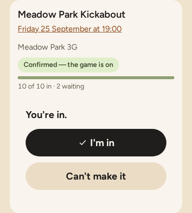

### 2.2 Your account — `GET/POST /app/account`
`Your name` (field + `Save`); `Signing in` (the email address, read-only, and `Manage your
passkeys`); **`This device`** — one panel, "Keep Make The Team handy and choose how this device
reaches you.", with two task sections `Install the app` and `Manage notifications` (which holds
`Your devices`, each with `Test` and `Remove`); **`Recent fixtures`** — the last 20 across every
game, each linking to the fixture, with your answer and the result once locked; then `Delete my
account and data` · `Privacy`, and `Sign out`.

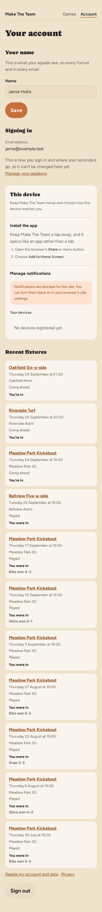

### 2.3 Passkeys — `GET /app/passkeys`
Whether one exists and `Add a passkey`. Its own page because WebAuthn cannot work without
script.

### 2.4 Delete my data — `GET/POST /app/delete`
One page in four states: offer (what goes, a two-day delay, `Delete my data`), pending
(`Keep my account`), sole organiser (refused, naming the games), held up. "Only you can start or
stop this."

### 2.5 A game, as a player — `GET /g/:id`
A separate renderer from the organiser's, so organiser capability cannot leak in.
- Game (h1); the preview banner when an organiser is using `See this as a player`; venue and
  address; an archived notice if archived; **last result** (absent until a fixture has locked;
  the same words the fixture's own panel uses); the open fixture with its answer block, teams
  and squad; auto-decline; `Coming up`; `Standings`; `Games you've played`; freshness bar.
- **Standings** — position, player, P, W, L, D, GD, Win%, Pts; three for a win, one for a
  draw; shared positions for true ties. Your row is marked where it falls, never moved. Any
  heading sorts the table; the choice is remembered per player across squads, and `Pts` is the
  way back. On a phone W, L and D are hidden unless sorted by. **Not rendered at all** — no
  heading — when the viewer may not see it or there is nothing to show.

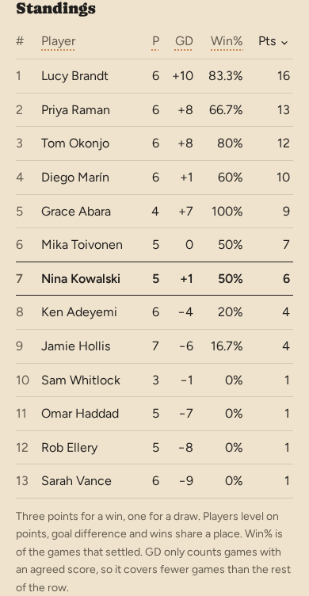

### 2.6 A fixture, as a player — `GET /g/:id/f/:fixtureId`
- Game (h1), preview banner, venue, kickoff, status; a nudge if not invited yet; then the
  **result panel** — above teams and squad, because on a played fixture those are history;
  then teams ("You were on Bibs." once played, "You're on" before); squad; auto-decline on an
  open fixture.
- **Picking the teams:** a delegate sees "The organiser has asked you to pick the teams for this
  one. You can also mark players in or out and add a guest if plans change." and `Pick the
  teams`, which links to §3.6b.
- **Result panel:** `Result so far` with each candidate and its backers and `Agree`; once
  anything is filed, the form hides behind `I remember a different result`; "Locks <date>.";
  the winner's score first ("Skins won 3–2"); "Score not agreed." when locked without one.
  The result window is the game's own, from full time: 12 hours to a week, 24 hours by
  default.
- **Player of the match** (M68), directly under the result panel as a plain section, never a
  second card: while the result window runs, a voter sees `Who played best?` and a radio per
  player who was in (guests included, themselves left out) and `Vote`; once voted, "You voted
  for <name>." with the ballot behind `Change my vote`. No counts while open — "Votes are secret
  until voting closes on <date>." Closes at the result deadline even if nothing was filed; then
  "<name>" and "<n> votes" (ties are joint), or nothing at all below two votes. Absent when the
  squad is hidden from players. Same voters as the result.
- Out that week: read, but not file. Not a member: 404.

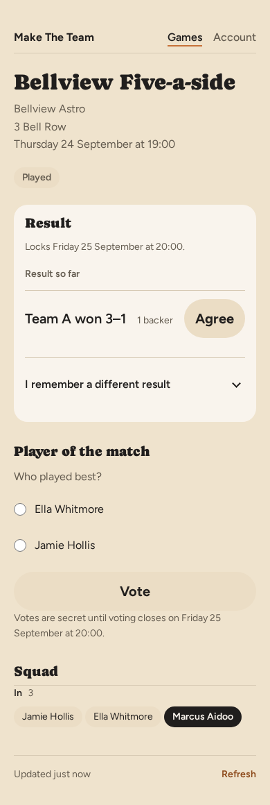

### 2.7 Past fixtures — `GET /g/:id/fixtures`
One route, dispatching by role. An organiser sees every past fixture, cancelled ones included
("Every fixture that has been and gone, cancelled ones included."); a member sees the played
fixtures they had an answer on ("The games you were in the squad for."). Each row: kickoff as a
link, status, headcount, result once locked. At most 50. "Back to the game", then freshness.

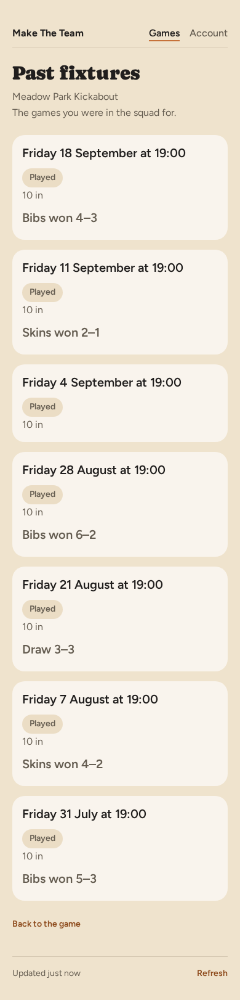

## 3. Organiser

### 3.1 Set up or edit a game — `/g/new`, `/g/:id/edit`
One form. Name, venue, address; day and how often; kickoff and minutes; minimum and maximum;
`Prefer even numbers`; `Let players see who else is playing`; the two team names. **Edit only:**
- `Notifications` — a table with Email and Push columns, one row per message: remind players,
  warn me when short or uneven, tell players when I publish teams, nudge me to post to the
  group chat (push only), ask players how it went, tell a player when I hand them the pick.
  Each has a hint and its timing. A channel the admin has switched off is disabled and says so.
  On a phone each row is a card.
- `Invites` — `Ask in priority order` and `Edit the invite order →`. Head starts live on the
  invite order; a save whose new times would ask a group after the cut-off is refused here.
- `Advanced` — time zone, venue link, how long a result stays open to argument.
- `Archive this game` (danger link) at the foot.

Editing never moves a fixture people have already been emailed about.

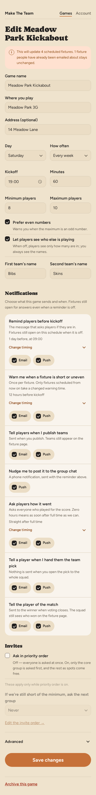

### 3.2 A game, as organiser — `GET /g/:id`
Game (h1); problem and broadcast receipt; venue; odd-maximum nudge; archived banner; `Edit this
game`; `See this as a player`; last result; `Coming up` (compact date, status, count);
`Past fixtures`; **`Squad (N)`** — each row the name, `organiser (you)`, `(guest)`, the two
amber reachability markers (messages failing, not seen for 14 days), `Auto-declining` and
`Unconfirmed` pills, and a `Manage` disclosure (view, change role, remove); `Standings`; the
`Invite people` card (link, `Copy`, `Show the QR code`, `Replace this link`); `Message
everyone`; freshness. An archived game hides everything that could change it.

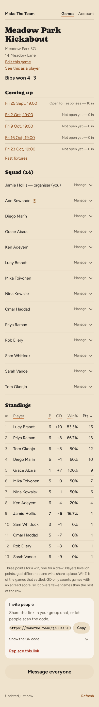

### 3.3 Squad member — `GET /g/:id/squad/:playerId`
Name; "In <game>."; `What we have for them` — email, "Player, since <date>", and **how they hear
about games** (all four reachability markers in words). No controls; the back-link says where to
change the role or remove them.

### 3.4 Remove a member — `…/squad/:playerId/remove`
`Remove <name>?`, exactly what happens, and that they can rejoin with the invite link.
`Remove <name>` (danger) and `No, leave the squad as it is`.

### 3.5 A fixture, as organiser — `GET /g/:id/f/:fixtureId`
The busiest screen. In order: game (h1); `Jump to`; notices; kickoff, venue; `See this as a
player`; status and capacity; `Open it now` (scheduled only); over-capacity; the over-limit
confirmation ("<game> is full (10 of 10). Add Nadia anyway?"); **result panel** and player of the
match (played only, §2.6);
**`Squad`** — In/Out segments per member (`Promote` for the waitlisted, `Invite now` for the
not-yet-asked), guests with `Remove`, "marked in by …" lines; `Invite progress` (gated games);
**`Teams`**; `Who picks the teams?`; `Add a guest`; `Post to WhatsApp`; `Message players` and
`What has happened`; "Back to the game"; freshness.

- **Correction window (M64).** After full time and until the result locks, the squad controls,
  guests and team picker stay live: "This game has been played. You can still correct who
  played and which side they were on until <deadline>." Nobody is promoted off the waitlist
  after full time, and teams cannot be published.
- **WhatsApp** prepares the message for the group chat, optionally with the squad link and the
  invite link. Never a per-player link.

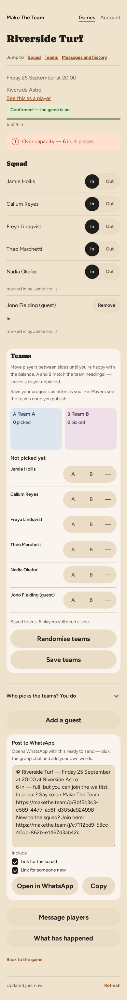

### 3.6 Team picker — a section of 3.5
A contained workspace: `Teams`, what to do, the two sides with counts, then `Not picked yet`
with an `A` / `B` / `—` choice per player who is in (guests included, waitlist excluded).
Drag-and-drop and `Randomise teams` with script; without it, a saved-counts line and a flat
list. A live status line says "Unsaved changes. Save teams before publishing." or "Saved teams.
N players still need a side."; `Publish` is disabled while unsaved. **Saving updates every
player's page; publishing sends the email.** Notes cover a changed squad, email switched off,
and correction mode.

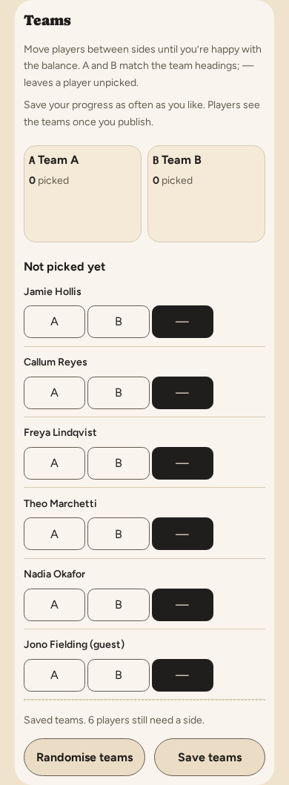

### 3.6a Who picks the teams? — a section of 3.5
A disclosure summarising the current choice — `You do`, `Somebody in the squad`, `Anyone in the
squad` — open unless it's you. Per fixture, never per game. Handing it to a named player emails
them (if that notification is on); opening it to everyone sends nothing.

### 3.6b Picker page — `GET /g/:id/f/:fixtureId/teams`
For the delegate (and reachable by the organiser). Game, why you're here, kickoff, venue,
status, then — for the organiser or a **named** delegate — the full `Squad` controls (In/Out,
`Promote`, guest `Remove`, `Add a guest`, the over-limit confirmation, the correction note),
then `Teams`, then "Back to the fixture". An `Anyone in the squad` member gets the picker only.
In that mode the first announcement is anyone's and later ones are the organiser's.

### 3.7 Message the squad — `/g/:id/message`, `/g/:id/f/:fixtureId/message`
One renderer, two scopes. Fixture scope asks `Who gets this message?` — Playing, On the
waitlist, Not answered yet, Can't play, each with a count — and opens on the largest non-empty
audience. Subject, message, Email and Push toggles (an admin-disabled channel says so), and
`Send to N players`. Success returns to the game or fixture with "Sent to N players by email."
No delivery report.

### 3.7a Add a guest — `…/f/:fixtureId/guest/add`
Its own page, from `Add a guest` on 3.5 or 3.6b. "Someone playing just this once. They won't be
emailed — you'll need to tell them yourself…", the places left or the over-limit warning
*before* the name is typed, `Add guest`, and "Back to the fixture" (to the picker page for a
delegate).

### 3.8 Invite order — `GET/POST /g/:id/invites`
For `Ask in priority order`: a group select per member (sized on its `.select` wrapper, so the
chevron is part of the control); per group, `Move up`/`Move down` beside its number — disabled
where there is nowhere to go, since the core group is chosen by membership and "everyone else" is
pinned last — and a head start ("asked N waking hours after the group above"); "everyone else" shown last, named, with no
remove control and a choice between a head start and "only if the groups above can't fill the
game". `When each group is asked` lays the slowest schedule against the next fixture, marking a
group asked after the cut-off (three hours before kickoff) in the warning colour. `Save invite
order`, then `Check schedule`, which shows the proposed times without saving. A schedule that
does not fit is refused with the longest head start that would. Scriptless. Saving acts at once.

### 3.8a Replace the invite link — `/g/:id/invite/rotate`
Says it cannot count who holds the link, and the one number it knows (the squad, who are not
affected). `Replace the link` (danger) and the larger `No, keep the link I have`.

### 3.9 Archive a game — `/g/:id/archive`
From the edit form. `Archive <game>?`, what stops, and a consequence line counting fixtures
called off and players emailed. `Archive <game>` (danger) and `No, keep it going`. Reversible
from the game page.

### 3.10 What has happened — `…/f/:fixtureId/timeline`
`What has happened`, the game and kickoff, then `Fixture history` — "Invitations, answers and
organiser actions, newest first. Only what has happened since this page was added…" — grouped
by day. Titles are a fixed vocabulary (`Opened for answers`, `Answered: in`, `Set to in`,
`Promoted off the waitlist`, `Guest added`, `Teams announced`, `Invitation sent`, `Called off`,
`An email could not be sent`…). No actor reads `Automatically`.

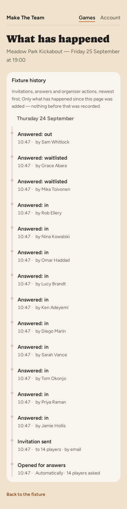

## 4. Admin

`is_admin` draws the header link; every handler re-checks it; a non-admin gets a 404.

- **4.1 Index — `/app/admin`.** "Operational tools for keeping the service healthy." Five
  links with a line each. A menu, not a dashboard.
- **4.2 Sign-up allow list — `/app/admin/allowlist`.** `Who can sign up` (allow list only /
  open to everyone — opening is the consequential press); `Addresses on the list`, with config
  entries labelled and not removable; add form.
- **4.3 Sign-in doctor — `/app/admin/sign-in`.** `Check an address` with a per-door verdict;
  recent link requests; recently refused addresses. Times in UTC.
- **4.4 Email delivery — `/app/admin/delivery`.** `Today` — sent against the ceiling and the
  notifier; the 20 most recent notifications.
- **4.5 Usage — `/app/admin/usage`.** "Read at <UTC>." Scale, activity (7 and 28 days), did it
  work, limits (with a warning only when the hourly sweep has stopped), per game. No charts.
- **4.6 Notifications — `/app/admin/notifications`.** A site-wide switch per message and
  channel: "Off here is off for every game." Three bands — owners can also switch off,
  administrator only, never switched off (with the reason).

## 5. Cross-cutting behaviour

The product constraints — the rules a design may not undo — are in
[UI standards](ui-standards.md#1-product-constraints). The choices below are the product's
current opinions; each is defensible and open to challenge.

- **Light server rendering, script as sugar.** Script today: copy buttons, QR disclosure,
  drag-and-drop and randomise on the picker plus its draft status, install prompt, push,
  passkeys, the sign-in button and installed-app reorder, WhatsApp options, the freshness
  reload, the presence ping and the update overlay. More is welcome if the no-script core
  survives.
- **Almost every destructive action has its own confirmation page** that spells out the
  consequence — remove member, leave, delete account, cancel fixture, replace invite link,
  archive. Removing a guest is immediate. Reversing your own answer within 20 seconds asks
  in place.
- **Waitlist promotion is automatic and silent** — the promoted player is emailed and nobody
  else is told — and never happens after full time. An organiser can `Promote` by hand.
- **Auto-decline means total silence for that squad, and `I'm in` is never taken away.**
  Accepting one fixture does not switch it off. It is a snapshot of the squads held when
  switched on; a squad joined later starts unmuted.
- **Guests exist for one fixture only** — no link, no email, no membership.
- **Capacity can be exceeded deliberately**, and the fixture then says "over capacity" to
  everyone rather than hiding it.
- **Seven pages carry a freshness bar** — dashboard, both game renderings, all three fixture
  pages, past fixtures: "Updated 3 minutes ago · Refresh". `Refresh` is a plain GET. With script,
  returning to a page left over a minute re-fetches it — unless a form on it has been touched.
  Separate from the **update overlay**, which appears only in the installed app when a new
  version deploys.
- **Every signed-in page reports the player as seen**, at most hourly, including whether it is
  running installed. An uninstall is never observed, so "not installed" means "never seen
  installed".
- **Results are claims until they lock.** Anything that shows a result as fact — last result,
  recently played, account history, past fixtures — shows nothing until the window closes; the
  fixture's own panel is where a live tally is shown, with its backers.
