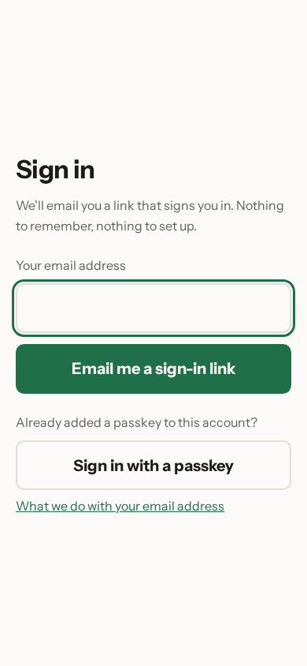
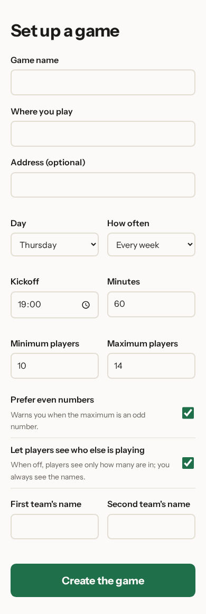
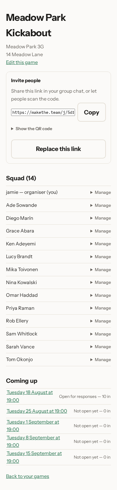

# Setting up a game

You have a pitch booked and a group chat full of people who never answer. This
chapter gets the game into Make The Team, which takes about a minute.

## Signing in

There is nothing to sign up for. Type your email address, tap **Email me a
sign-in link**, and open the email that arrives — the link signs you in. There
is no password to choose and none to forget.

If you have already added a passkey to your account, **Sign in with a passkey**
below the button uses it instead, and skips the email entirely. Chapter 7
covers adding one.

## Setting up the game

Everything the game needs is on one screen.

- **Game name** is what people will see in the emails — "Meadow Park
  Kickabout" rather than "Booking 4".
- **Where you play** is the pitch. **Address** is optional; fill it in and
  people can tap it into a map.
- **Day** and **How often** set the repeat. Pick Thursday and Every week and
  you never touch it again.
- **Kickoff** and **Minutes** are the start time and how long you play for.
- **Minimum players** is the number you need for the game to be worth turning
  up to. **Maximum players** is how many places there are — once that many
  people have said yes, everyone after them goes on the waitlist.
- **Prefer even numbers** is ticked to start with. Leave it ticked if you'd
  rather not play with uneven sides.

Tap **Create the game** and it exists.

## Your game

This page is the game's home, and it's where you'll come back to.

At the top is the name, the pitch and the address, with **Edit this game** for
when any of that changes. **Invite people** is a card of its own, holding the
link to share, a **Show the QR code** line that opens the same link as a code
when you want it, and **Replace this link** — that's chapter 2.

**Squad (14)** lists everyone who has joined. This game has fourteen people in
it, with jamie marked as the organiser — that's you, because you set it up.
Chapter 5 covers what **Manage** on each row can do.

**Coming up** is the part that does the work. You created the game once, and
the fixtures for the next few weeks are already there, one a week at 19:00.
The first one is open and has ten people in; the later ones show nobody yet,
because their reminders haven't gone out. The list keeps refilling itself as
weeks go by.

Next: [inviting your squad](02-inviting-your-squad.md).
