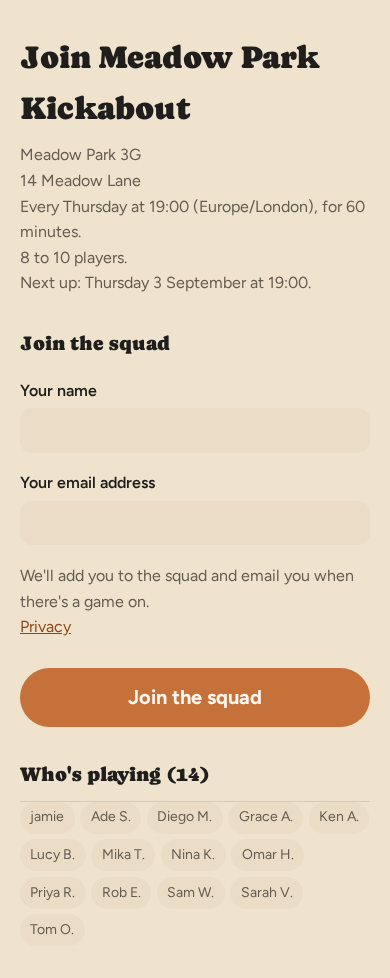
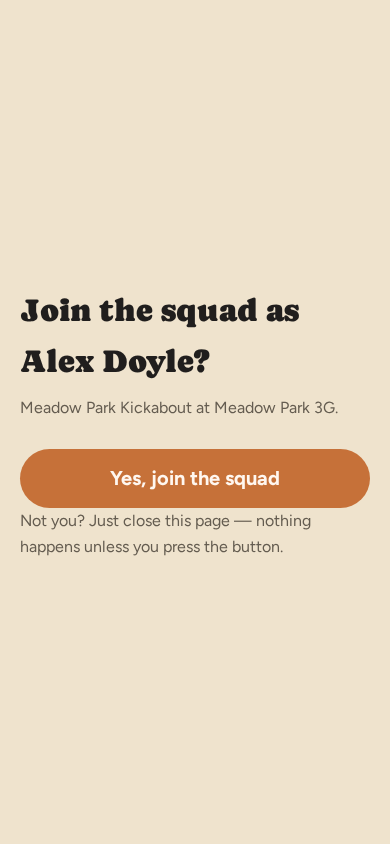

# Inviting your squad

The game exists; now it needs people. There is one link, it never expires on
its own, and anyone who has it can join. Paste it into the group chat and
you're done.

## The link

On the game page, under **Invite people**, is the link. Tap **Copy** and it's
on your clipboard, ready to paste into WhatsApp, a text, or an email.

You don't need to send it to people one at a time, and there's no list of
addresses to type in. One link does everyone.

## The QR code

Underneath the link is a line reading **Show the QR code**. Tap it and the
same link opens up as a code, for the people standing in front of you. Hold
your phone up at the end of a game and let them point their cameras at it —
quicker than spelling out an address in a car park. Tap the line again and it
folds away, so the game page isn't carrying a code you only need now and then.

## What a player sees

This is where the link takes them. They don't have to sign up for anything to
get here.

The top of the page tells them what they're joining: the Meadow Park Kickabout,
played at Meadow Park 3G every week at 19:00 for sixty minutes, 8 to 10
players, and when the next one is.

Then comes the only thing they have to do. Under **Join the squad** they put
in a name and an email address and tap the button. The address is the whole
point: it's how they get told when there's a game on. There's no password and
nothing else to fill in.

Under that, **Who's playing (14)** shows the squad they'd be joining — first
names and an initial, so nobody's full name is on a page anyone with the link
can open. It sits below the form rather than above it because it's what they
read while deciding, not something to scroll past on the way to joining.

Once they've joined, their name appears in your squad and they'll get the
reminder for the next fixture along with everyone else.

## Confirming a new address

<!-- The "Check your inbox" page has no screenshot and no manifest entry: it is
     only reachable by submitting the join form, and the catalogue and guide
     captures are both GET-driven. -->

The first time somebody types an address the app has never seen, tapping the
button doesn't seat them straight away. Instead they land on **Check your
inbox**: an email is on its way to the address they typed, naming the game and
the name they typed and nothing else — no fixture details, no squad list, no
other link — because it's the one message the app will send to an address
before it knows it reaches anyone.

Tapping the button in that email opens **Join the squad as *Name*?**, with one
button of its own. Pressing it is what actually seats them, and from there
they land on the same page anyone joining directly sees.

This only happens once per address. Anyone who has confirmed a join before —
for this game or any other — or who has ever signed in, skips the inbox step
entirely: the invite page's button seats them straight away, exactly as it
always has.

Next: [answering a reminder](03-answering-a-reminder.md).
