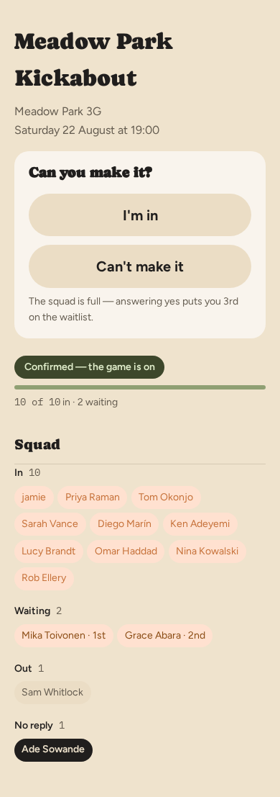
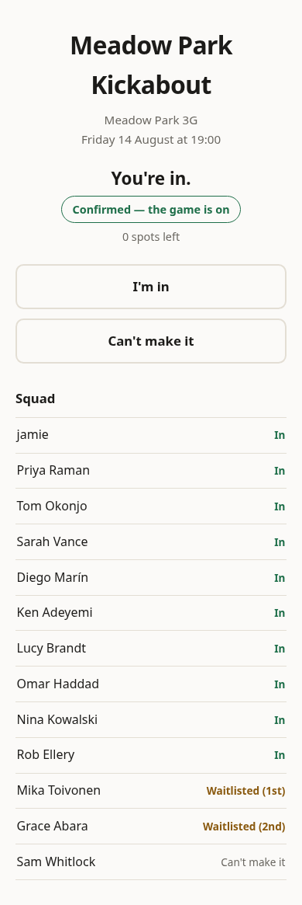
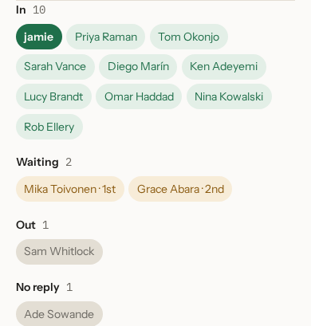
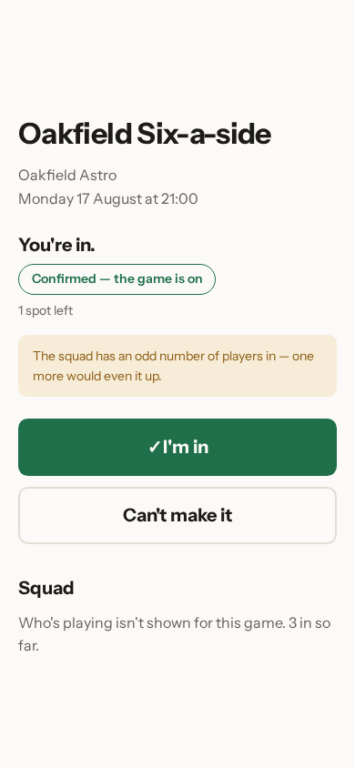
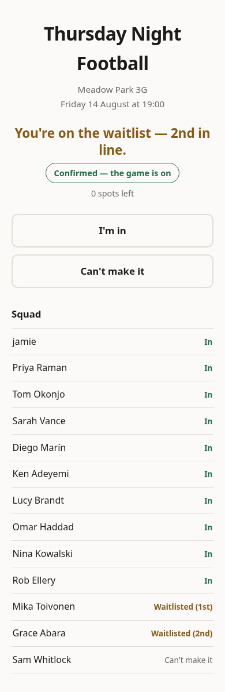

# Answering a reminder

The day before a game, everyone in the squad gets one email. It says when and
where, how many people are already in, and how many places are left. It has
two buttons.

You do not need an account, a password, or the app open. It takes two taps: one
in the email, which opens the page below, and one on that page, which saves
your answer.

## Arriving from the email

Tapping either button in the email brings you here, and nothing has been
recorded yet: the page asks **Can you make it?** and waits for you.

**Confirmed — the game is on** means enough people have already said yes for
the game to go ahead. Under it, a bar fills up as people answer, with the
count spelled out beneath it — **10 of 10 in · 2 waiting**. The bar is full
and two people are already queued behind it, which is what the waitlist below
is about. Because
there's no room, the page says so under the two buttons, before you tap
either of them: **The squad is full — answering yes puts you 3rd on the
waitlist.** When your organiser
allows it, the squad list shows who has answered what, so you can see who
you'd be playing with before you decide — more on that below.

## Saying you're in

Tapping a button on this page is what records your answer. Tap **I'm in**
while there is a place free and the page comes back saying **You're in.**,
with a tick on the **I'm in** button and your own chip sitting under the
squad's **In** heading below.

That headline is how you know it worked. Close the page without tapping a
button on it and nothing has been saved — you are not counted, and the place
is still free for somebody else.

Both buttons stay on the page afterwards, so you can change your mind by
tapping the other one any time before kickoff.

## Who else is playing

By default, this is what you see: everyone in the squad, grouped by what they
answered — **In**, **Waiting**, **Out**, **No reply** — as a row of chips
under each heading. Your own chip is filled in, so you can pick yourself out
among the rest.

Your organiser can turn that off. Do that, and the page shows a count instead
of the list — **3 in so far.**, here — plus your own answer above it. You
still know whether there are enough people and whether you're in. You just
don't see who anyone else is.

## When it is already full

The Meadow Park Kickabout has room for ten. If you tap **I'm in** after the
tenth person has, you go on the waitlist instead and the page tells you your
position — here, second. The **I'm in** button changes to say so too: it now
reads **I'm in · waiting**, in amber rather than the green a confirmed place
gets, so it never looks like a place you don't have.

You do not need to do anything else. If someone drops out, the person at the
top of the waitlist is moved in automatically and emailed. Nobody else is
told.

When the squad is showing, it tells the same story from the outside: ten
chips under **In**, then a **Waiting** group with Mika Toivonen and Grace
Abara, each chip carrying its place in line — Mika's reads **· 1st**, Grace's
**· 2nd**. Anyone who has not answered yet — Ade Sowande here — sits under
**No reply**.

## When the teams go up

Some organisers pick the sides before the night. If yours does, one more email
arrives, with the game's name and **teams are up** in the subject line. It
opens with the single thing you need — **You're on Team A.**, or whatever your
organiser has called the sides — and, if your game shows the squad, both
line-ups underneath it.

You don't have to keep that email. Go back to the same page you answered on
and your side is there too, above the squad, worded exactly the same way. It
is always your own side, even in a game with the names turned off: that page
still tells you which side you're on, just not who is on it with you.

Your games page says it too, on the card for that fixture, so you can see which
side you're on without opening anything — and on the card for the game you have
just played, in the past tense. As with the email, it appears only once your
organiser has actually sent the teams round; a pick they are still working on
shows nowhere.

If you came off the waitlist after the teams went round, there won't be a side
for you yet, and the page says so — **Your side hasn't been picked yet.** —
rather than showing you two line-ups with no mention of you. Your organiser is
told the same thing, and can't send the teams round again until you have one.

Nothing about the teams changes how you answer. If you can't make it after all,
tap **Can't make it** as usual. Nobody is shuffled between sides automatically
— your organiser is told the teams need another look, and it's up to them
whether to send them round again.

Next: [when someone drops out](04-when-someone-drops-out.md).
