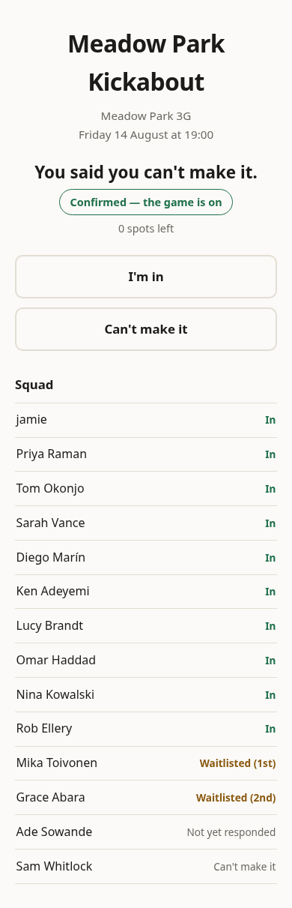
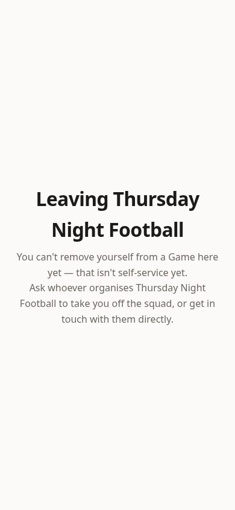

# When someone drops out

Work runs late, a child gets ill, a back goes. Somebody who said yes on Monday
can't play on the night. This is the part that usually costs an organiser twenty
messages, and here it costs nobody anything.

## Changing your mind

Both buttons stay on the page after you've answered, so changing your mind is
the same action as answering in the first place: go back to the page — from the
email again, or from the tab you still have open — and tap **Can't make it**
there.

The page then says **You said you can't make it**, and the squad below updates.
Sam Whitlock has answered that way here, and the answer sits beside that name
at the bottom of the list. Tapping **I'm in** puts you back, and there's no
penalty and no message to write.

Say one of the ten players marked **In** drops out. The place doesn't sit
empty: Mika Toivonen, first on the waitlist, is moved in and gets an email
saying so. Nobody else is told, because nobody else needs to do anything. As
the organiser you don't have to be awake for it.

If the game drops below the minimum you set, you'll get an email about that —
see [calling a fixture off](06-calling-a-fixture-off.md).

## Leaving for good

Every reminder email has a link in its footer for people who don't want them
any more. This is the page it leads to.

At the moment it explains rather than does: you can't take yourself off a squad
here, so it asks you to speak to whoever organises the game. If you're the
organiser and somebody sends you this, taking them out takes two taps — see
[running your squad](05-running-your-squad.md).

Next: [running your squad](05-running-your-squad.md).
