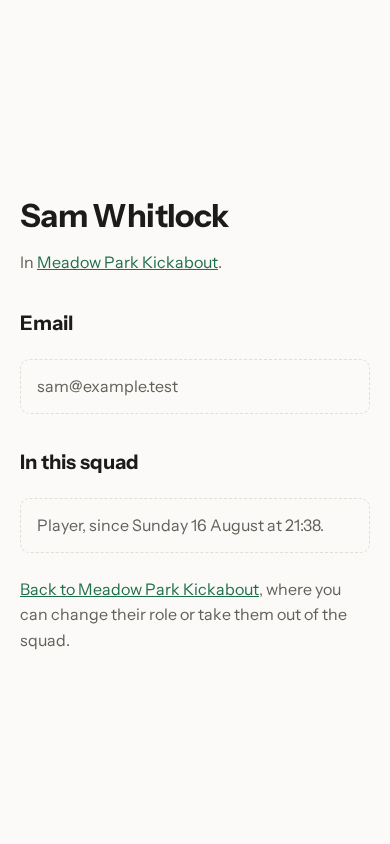
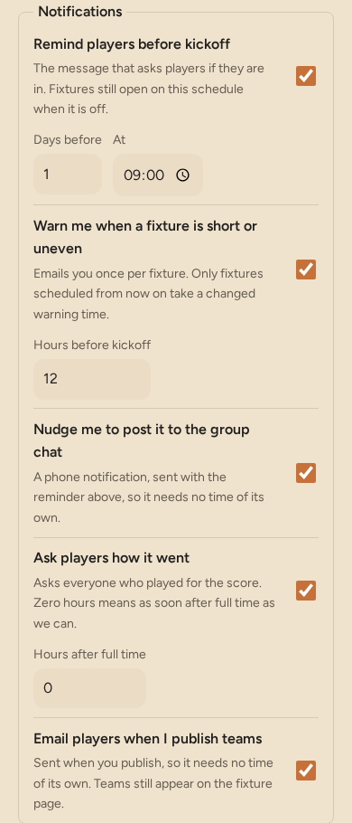
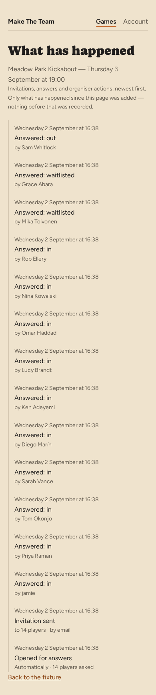
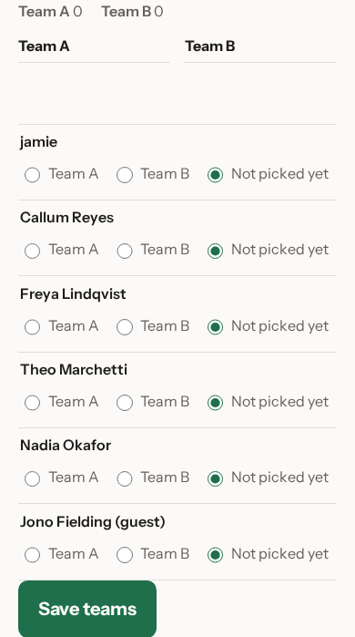

# Running your squad

Squads change. Someone moves away, someone else starts doing half the
organising, the pitch changes its booking time. Everything in this chapter is
on the game page, or one tap from it.

## Who can organise

Every person in the squad has a row with their name and a **Manage**
disclosure. Open it and two things are inside: a button and a link.

A row for somebody who was seated before the app started confirming new
addresses, and whose address has still never answered a confirmation, carries
an **Unconfirmed** tag beside their name. Nothing removes such a row on its
own — **Remove**, in the same **Manage** disclosure, is how you tidy it by
hand if you want to.

**Make an organiser** gives that person the same powers you have: they can
invite people, change the game's details and take people out. Handy when you're
away and don't want the game to depend on you having signal.

Your own row is the one at the top, marked **organiser (you)**. Open its
**Manage** disclosure and it offers **Make an ordinary member** instead —
that's how you step back from organising without leaving the squad. A game
always has at least one organiser: if you are the only one, the app refuses to
make you an ordinary member, so you cannot leave the game with nobody able to
change anything. Make someone else an organiser first, and then you can step
back.

## Looking somebody up

Open **Manage** next to anybody in your squad and the first thing there is
**View details**. It's a small page: their name, their email address, whether
they're an organiser, and how long they've been in the squad.

You can't edit any of it, and you can't see what they've played. Their name is
theirs to change, and their fixtures in *other* games aren't yours to look at
— this page is about your squad, not about a person. Changing their role or
taking them out of the squad is still done back on the game page, where it's
always been.

## Taking someone out

**Remove**, inside that same **Manage** disclosure, doesn't remove them
straight away. It opens a page that names the person and spells out exactly
what will happen: Sam Whitlock would be taken out of the squad for the Meadow
Park Kickabout and told by email, and because they have no upcoming fixtures,
nothing else changes.

**Remove Sam Whitlock** confirms it. **No, leave the squad as it is** backs out
and nothing has happened.

It isn't a punishment and it isn't permanent — the page says so. Anyone you
remove can join again themselves using the invite link. What you can't do is
put them back yourself.

## Changing the details

**Edit this game** at the top of the game page opens the same form you filled in
at the start, already holding what the game uses now: Meadow Park Kickabout,
Meadow Park 3G, 14 Meadow Lane, its day of the week, 19:00 for sixty minutes,
8 to 10 players, preferring even numbers.

Read the note at the top before you change anything. Here it says the change
will update four scheduled fixtures, and that one fixture people have already
been emailed about stays as it is. That's deliberate: once your squad has been
told a time, moving it under them would be worse than leaving it. Rescheduling
the imminent game is a job for the group chat, or for calling it off — see
[calling a fixture off](06-calling-a-fixture-off.md).

**Advanced** hides the settings you'll rarely want — the time zone, a link to
the venue, and how long a result stays open to argument. That last one runs
from the final whistle and starts at a day, which is enough for most squads;
stretch it to a week if yours argues by group chat over several evenings. It
takes effect straight away, including on a fixture you have already played.
**Save changes** applies everything at once.

## Choosing what your game sends

**Notifications**, on the same form, is a table: one row per message the game
sends by itself, an **Email** box and a **Push** box beside it, and the
timing underneath where the message has one. A row with a dash instead of a
box has no version on that channel — there's nothing to switch on there.
Every box starts checked.

- **Remind players before kickoff** is the message that asks people if they're
  in, and **Days before** and **At** decide when it goes. Turning it off stops
  the message, not the fixture: fixtures still open on the same schedule, so
  anyone with the link can still answer.
- **Warn me when a fixture is short or uneven** emails you once about a fixture
  that needs a hand, **Hours before kickoff** ahead of the game. Changing the
  hours applies to fixtures scheduled from now on, not to ones already made.
- **Tell players when I publish teams** decides whether publishing tells the
  squad. With it off, publishing still puts the teams on everyone's page — it
  just sends nothing, and the fixture page says so.
- **Nudge me to post it to the group chat** is the phone notification that
  reminds you to share the fixture. It rides with the reminder above, so it
  has no time of its own, and no Email box — it's push only, so that row shows
  a dash under Email.
- **Ask players how it went** is the prompt for the score after full time.
  **Hours after full time** holds it back if you'd rather it landed the next
  morning; zero means as soon as we can.
- **Tell a player when I hand them the team pick** is the message sent when
  you give the team-pick decision to one player rather than opening it to the
  whole squad. Nothing is sent for the whole-squad case.

An organiser can switch any of these off, but not always on: the site
administrator can switch a channel off for everyone, for one notification or
for all of them. If they have, that box shows greyed out and unchecked, with
a line underneath saying it's off everywhere for now — your own choice is
kept underneath it and comes back on its own if the administrator turns the
channel back on.

## Choosing who sees the squad

**Let players see who else is playing**, further down the same form, decides
what a player finds on their response page: everyone's name and answer, or
just a count. It's checked by default, which is why the walkthrough in
[answering a reminder](03-answering-a-reminder.md) shows names.

Uncheck it and save, and every player's page switches to counts only — no
other names, no other answers, just theirs and how many are in so far. It
changes nothing for you: as the organiser you always see the whole squad,
whatever this is set to.

## One fixture at a time

Every fixture has its own page, separate from the game page above — tap its
date under **Coming up** to open it.

Beside each squad member's name is a segmented **In**/**Out** control that
shows which one already applies as well as setting it, so most rows need no
status text at all. Two rows are different: someone on the waitlist keeps a
label naming their place in line, because the control cannot say "in, but
second in the queue"; and a guest has no In/Out control at all — they were
added for this fixture only, so their row shows their status in words beside
a **Remove** button instead. Guests are covered in their own section below.

## Opening a fixture early

A fixture opens for answers on its own a few days before, and most weeks you
never think about it. When you want it open now — the pitch got moved, or
you're organising round a bank holiday — **Open it now** on the fixture's page
does it immediately.

The page tells you what pressing it will do, and that depends on your game. If
you ask everybody at once, nobody is emailed yet: the day-before reminder still
goes at its usual time, and the fixture is simply open for anyone who looks. If
you ask in priority order, your first group is invited straight away and the
rest wait their turn as usual.

## Asking someone out of turn

If you ask in priority order, each group is invited as places come free, and
the fixture page shows an **Invite now** button beside anybody the order hasn't
reached yet. Pressing it asks that one person now, without disturbing the order
for everyone else — for the friend who always plays and happens to be low down
the list, or the goalkeeper you'd rather not be short of.

## Moving someone off the waitlist

Where a waitlisted player's row would say **In**, it says **Promote** instead.
It does what it says: moves them off the waitlist and into the game, and emails
them. It reads as its own act rather than as answering for them, because it is
one — they already said yes, and nothing is going to ask them again.

## What has happened

**What has happened**, beside **Message players** at the bottom of a fixture's
page, is that fixture's history in plain words, newest first: when it opened,
who was invited and when, every answer as it came in, guests added or removed,
teams saved and announced, whether it was called off, and any email that
couldn't be sent.

It is careful about *who*. Something the app did on its own says
**Automatically**, so a fixture that opened on schedule and one you opened
early don't read the same — that difference is most of why the page is worth
having. Something somebody did carries their name.

One caveat the page states itself: it only knows about things that happened
since the feature was added. There is no way to fill in what came before,
because those facts were never written down. An empty stretch means "nothing
recorded", not "nothing happened".

## Answering for someone

Not everyone answers an email. If somebody tells you in person, on the phone,
or in the group chat, **In** or **Out** on their row records it for
them, exactly as if they had tapped the button themselves.

Once you do, a line appears under their name saying who marked them in — here,
Nadia Okafor never answered their own reminder, and it now says **marked in by
jamie**. It shows on the player's page too, not just yours: if they open their
own reminder link later, they'll see that somebody else answered for them, and
who. Nothing is hidden from the player whose answer it is.

## Adding a guest

Sometimes someone is playing just this once — a friend a regular brought
along, someone covering for the night. **Add a guest**, at the bottom of the
fixture page, is a single box for their name. Tap **Add guest** and they're in
the squad for that one fixture only.

A guest isn't a member of the squad. They don't get an invite link, they don't
get emailed — you'll need to tell them the details yourself — and they won't
be there next week unless you add them again. **Remove** on their row takes
them straight back out, with no confirmation page: there's no membership to
undo, only the one answer.

## Going over the limit on purpose

A guest, or someone you mark in, can take the squad past the number of places
you set. The app won't do that quietly: if adding them would go over the
limit, it stops and tells you the game is full and asks whether to add them
anyway. Nothing happens until you tap **Add them anyway**; **No, leave it**
backs out instead.

Confirm it, and the fixture page carries a plain notice for as long as it
stays over: **Over capacity — 6 in, 4 places.** Anyone who opens their own
fixture page sees the same thing, worded for them, so nobody wonders why the
squad looks bigger than the game allows. It's a call you made on purpose, not
a mistake the app happened to let through.

## Picking the teams

Under the squad on the same fixture page is **Teams**, where you split the
people who are playing into two sides.

Only players marked **In** are offered a side. Anybody on the waitlist isn't:
they haven't got a place yet, and putting them on a side would suggest they
had. A guest counts as playing like anyone else — Jono Fielding is in this
list.

Every name starts on **Not picked yet**, and has the two sides beside it. Work
down the list, tap a side for each person, and press **Save teams**. If you'd
rather drag, you can: the two sides are the columns above the list, and on a
phone or computer that allows it you can drag a name straight into one.
Dragging ticks the same button you would have tapped, so it's the same pick
either way, and on a device that won't drag, tapping is all there ever was.

If you'd rather not pick at all, **Randomise teams** deals everyone who's in
onto the two sides at random, as evenly as the numbers allow. It only sets the
choices — nothing is saved until you press **Save teams** — so press it again
if you don't like the draw, or move a name or two by hand first.

The sides are called **Team A** and **Team B** until you say otherwise.
**First team's name** and **Second team's name**, on the **Edit this game**
form a little below the setting above, rename them for every week the game
plays — Bibs and Skins, Reds and Blues, whatever your lot call them.

## Saving, and then telling people

Saving and telling the squad are two separate things, and the page says so:
**Only players who are in can be given a side. Nobody is told anything until
you publish.**

So a half-finished pick is fine. Save six of twelve, go and cook dinner, come
back and finish it. Nobody has seen anything, and nothing has been sent —
that's true up to your first publish. Once you've published a fixture once,
saving works differently, as the next section explains.

**Publish teams**, which appears once you've saved a pick, is what tells
everyone. Every player who is in and has an email address gets a message
saying which side they're on. Guests don't — they never get email from us, so
they're the one group you still tell yourself.

What you can't do is publish half a pick. If anybody who's in still has no
side, the page comes back and names them — **Everyone who's in needs a side
before you can publish. Still to pick: Freya Lindqvist.** — so you can finish
those few rather than hunt down which they were.

If the sides end up uneven and your game prefers even numbers, the picker
mentions it and leaves it there: **The sides are uneven at the moment. That's
fine if you meant it.** It's a note, not a refusal.

## When the squad changes afterwards

Somebody always drops out. When they do, nobody is moved between sides for
you, and nothing is sent to anybody a second time — the app doesn't decide
whether eleven people need another email. It tells you instead, above the
button: **The teams have changed since they were last sent out. Send them
again?**, and the button now reads **Publish again**.

The same happens the other way round. If somebody comes off the waitlist into
the free place, they turn up in the picker with no side and the same note
appears. You can't publish again until they have one, which is the point:
they're the person most in need of being told. Until you've given them one,
their own page says **Your side hasn't been picked yet.** rather than leaving
them staring at two line-ups they aren't in.

Sort the sides out and press **Publish again**, and the note goes: everyone
playing is now holding an email that matches the pick. It comes back the
moment they diverge again — including when *you* are the one who changed them.
Move two people between sides after publishing, press **Save teams**, and the
same note appears, because nine people are holding last week's version and
nothing has told them otherwise. Their own pages don't wait for **Publish
again**, though — the moment you save, each player's page shows the sides as
they now stand, so anyone who checks sees the true picture straight away.
It's only the email already sitting in their inbox that's out of date, which
is exactly what the note is warning you about. The button stays **Publish
again** from the first time you publish onwards, so you can always tell a
squad that has been told something from one that never has.

Once the fixture has been played or called off, the teams stay on the page as
a record of who was on which side. The controls go; the pick doesn't.

## Posting to your WhatsApp group

Most squads already live in a group chat, and the app doesn't try to replace
it. What it does is save you typing: the fixture page carries a **Post to
WhatsApp** card with the message written for you — the date, the venue, how
many are in and how many you still need, and the link people answer on.
**Open in WhatsApp** opens WhatsApp with it ready to send; pick the group, add
your own words if you like, and send. **Copy** puts the same text on your
clipboard for anywhere else.

The message changes with the fixture. Once you've published teams it offers
the line-ups first, with the numbers message still underneath; a cancelled
fixture offers the cancellation instead. Nothing in it is personal to one
player — the link is the game page, which everyone in the squad signs in to —
so it's safe to post where the whole group can see it.

If you've turned on notifications, you'll get one nudge per fixture the
morning the reminders go out — **Post it to the group?** — which lands you on
the card. After that, the numbers-short warning does the same job later on.

There's a matching **Post to WhatsApp too** button under the **Message
players** form, for when what you're sending the squad by email is worth a
line in the group as well.

## Replacing the invite link

If the link ends up somewhere you'd rather it hadn't — a public group, a work
channel, a stranger's phone — **Replace this link**, at the bottom of the
**Invite people** card on the game page, gives you a fresh one. The old link stops working immediately, so
share the new one with anybody still waiting to join. People already in the
squad aren't affected.

## Archiving a game

When a game has run its course — or was only ever a trial — **Archive this
game**, at the bottom of the **Edit this game** form, closes its book. The
page that follows tells you exactly what that means before you press anything:
how many upcoming fixtures will be called off, and how many people who'd said
they were in will be emailed to say so.

An archived game doesn't disappear. Everyone in the squad can still open it and
see its past fixtures and results; it just sits folded under **Archived games**
at the bottom of their list instead of among the games they're playing this
week. Nothing new gets scheduled, the invite link stops working, and none of
the settings can be changed.

If it turns out the game isn't over after all, **Unarchive this game** on its
page brings it back: fixtures start being scheduled again from now, and the
link works again. The fixtures that were called off stay called off — people
were told, and un-telling them isn't something the app does.

Next: [calling a fixture off](06-calling-a-fixture-off.md).
