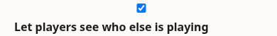
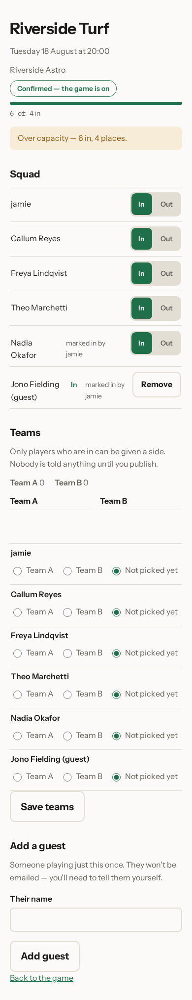
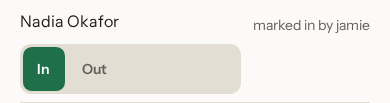
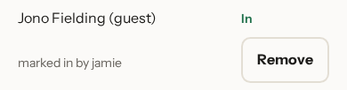

# Running your squad

Squads change. Someone moves away, someone else starts doing half the
organising, the pitch changes its booking time. Everything in this chapter is
on the game page, or one tap from it.

## Who can organise

Every person in the squad has a row with their name, a button and a link.

**Make an organiser** gives that person the same powers you have: they can
invite people, change the game's details and take people out. Handy when you're
away and don't want the game to depend on you having signal.

Your own row is the one at the top, marked **organiser (you)**. It offers
**Make an ordinary member** instead — that's how you step back from organising
without leaving the squad. A game always has at least one organiser: if you are
the only one, the app refuses to make you an ordinary member, so you cannot
leave the game with nobody able to change anything. Make someone else an
organiser first, and then you can step back.

## Taking someone out

**Remove** on someone's row doesn't remove them straight away. It opens a page
that names the person and spells out exactly what will happen: Sam Whitlock
would be taken out of the squad for the Meadow Park Kickabout and told by email,
and because they have no upcoming fixtures, nothing else changes.

**Remove Sam Whitlock** confirms it. **No, leave the squad as it is** backs out
and nothing has happened.

It isn't a punishment and it isn't permanent — the page says so. Anyone you
remove can join again themselves using the invite link. What you can't do is
put them back yourself.

## Changing the details

**Edit this game** at the top of the game page opens the same form you filled in
at the start, already holding what the game uses now: Meadow Park Kickabout,
Meadow Park 3G, 14 Meadow Lane, its day of the week, 19:00 for sixty minutes,
8 to 10 players, preferring even numbers.

Read the note at the top before you change anything. Here it says the change
will update four scheduled fixtures, and that one fixture people have already
been emailed about stays as it is. That's deliberate: once your squad has been
told a time, moving it under them would be worse than leaving it. Rescheduling
the imminent game is a job for the group chat, or for calling it off — see
[calling a fixture off](06-calling-a-fixture-off.md).

**Advanced** hides the settings you'll rarely want. **Save changes** applies
everything at once.

## Choosing who sees the squad

**Let players see who else is playing**, further down the same form, decides
what a player finds on their response page: everyone's name and answer, or
just a count. It's checked by default, which is why the walkthrough in
[answering a reminder](03-answering-a-reminder.md) shows names.

Uncheck it and save, and every player's page switches to counts only — no
other names, no other answers, just theirs and how many are in so far. It
changes nothing for you: as the organiser you always see the whole squad,
whatever this is set to.

## One fixture at a time

Every fixture has its own page, separate from the game page above — tap its
date under **Coming up** to open it.

Each row shows what the squad list already shows — in, waitlisted, out, or not
yet responded — and, beside every name, two buttons: **Mark in** and **Mark
out**.

## Answering for someone

Not everyone answers an email. If somebody tells you in person, on the phone,
or in the group chat, **Mark in** or **Mark out** on their row records it for
them, exactly as if they had tapped the button themselves.

Once you do, a line appears under their name saying who marked them in — here,
Nadia Okafor never answered her own reminder, and it now says **marked in by
jamie**. It shows on her page too, not just yours: if she opens her own
reminder link later, she'll see that somebody else answered for her, and who.
Nothing is hidden from the player whose answer it is.

## Adding a guest

Sometimes someone is playing just this once — a friend a regular brought
along, someone covering for the night. **Add a guest**, at the bottom of the
fixture page, is a single box for their name. Tap **Add guest** and they're in
the squad for that one fixture only.

A guest isn't a member of the squad. They don't get an invite link, they don't
get emailed — you'll need to tell them the details yourself — and they won't
be there next week unless you add them again. **Remove** on their row takes
them straight back out, with no confirmation page: there's no membership to
undo, only the one answer.

## Going over the limit on purpose

A guest, or someone you mark in, can take the squad past the number of places
you set. The app won't do that quietly: if adding them would go over the
limit, it stops and tells you the game is full and asks whether to add them
anyway. Nothing happens until you tap **Add them anyway**; **No, leave it**
backs out instead.

Confirm it, and the fixture page carries a plain notice for as long as it
stays over: **Over capacity — 6 in, 4 places.** Anyone who opens their own
fixture page sees the same thing, worded for them, so nobody wonders why the
squad looks bigger than the game allows. It's a call you made on purpose, not
a mistake the app happened to let through.

## Replacing the invite link

If the link ends up somewhere you'd rather it hadn't — a public group, a work
channel, a stranger's phone — **Replace this link** under the QR code on the
game page gives you a fresh one. The old link stops working immediately, so
share the new one with anybody still waiting to join. People already in the
squad aren't affected.

Next: [calling a fixture off](06-calling-a-fixture-off.md).
