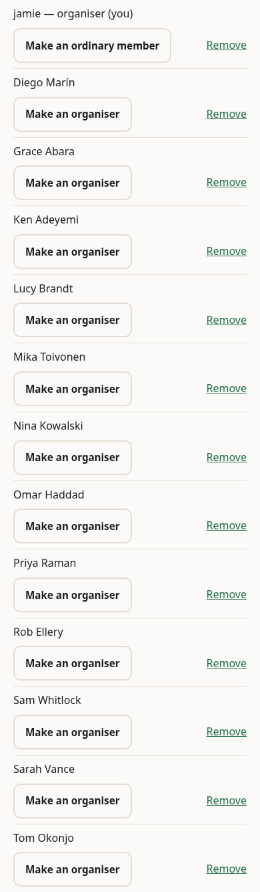
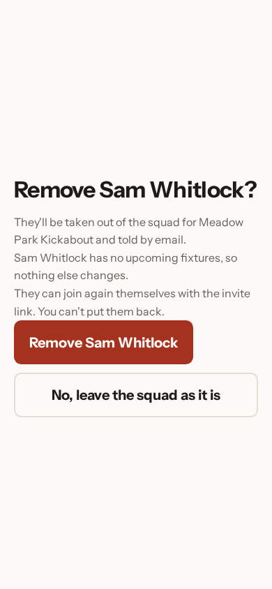
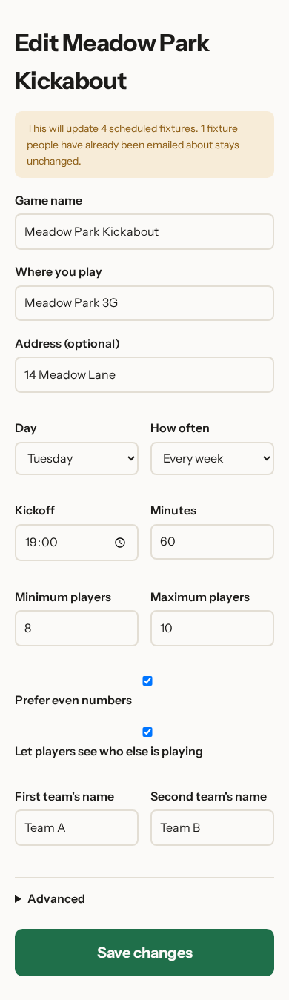

# Running your squad

Squads change. Someone moves away, someone else starts doing half the
organising, the pitch changes its booking time. Everything in this chapter is
on the game page, or one tap from it.

## Who can organise

Every person in the squad has a row with their name, a button and a link.

**Make an organiser** gives that person the same powers you have: they can
invite people, change the game's details and take people out. Handy when you're
away and don't want the game to depend on you having signal.

Your own row is the one at the top, marked **organiser (you)**. It offers
**Make an ordinary member** instead — that's how you step back from organising
without leaving the squad. Do keep at least one organiser, or nobody can change
anything.

## Taking someone out

**Remove** on someone's row doesn't remove them straight away. It opens a page
that names the person and spells out exactly what will happen: Sam Whitlock
would be taken out of the squad for Thursday Night Football and told by email,
and because he has no upcoming fixtures, nothing else changes.

**Remove Sam Whitlock** confirms it. **No, leave the squad as it is** backs out
and nothing has happened.

It isn't a punishment and it isn't permanent — the page says so. Anyone you
remove can join again themselves using the invite link. What you can't do is
put them back yourself.

## Changing the details

**Edit this game** at the top of the game page opens the same form you filled in
at the start, already holding what the game uses now: Thursday Night Football at
Meadow Park 3G, 14 Meadow Lane, every Thursday at 22:00 for sixty minutes, 8 to
10 players, preferring even numbers.

Read the note at the top before you change anything. Here it says the change
will update four scheduled fixtures, and that one fixture people have already
been emailed about stays as it is. That's deliberate: once your squad has been
told a time, moving it under them would be worse than leaving it. Rescheduling
the imminent game is a job for the group chat, or for calling it off — see
[calling a fixture off](06-calling-a-fixture-off.md).

**Advanced** hides the settings you'll rarely want. **Save changes** applies
everything at once.

## Replacing the invite link

If the link ends up somewhere you'd rather it hadn't — a public group, a work
channel, a stranger's phone — **Replace this link** under the QR code on the
game page gives you a fresh one. The old link stops working immediately, so
share the new one with anybody still waiting to join. People already in the
squad aren't affected.

Next: [calling a fixture off](06-calling-a-fixture-off.md).
