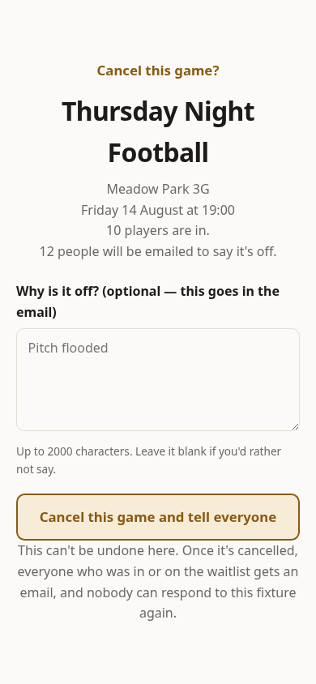

# Calling a fixture off

Some weeks it isn't on. The pitch is under water, or four people are in and
you need eight. Calling it off early is a kindness, and it takes one page.

If a fixture is short of players, or has an awkward number for even sides,
you'll get an email about it with a **Call this game off** button. That button
opens this page. You can only get here on purpose, and nothing happens until
you confirm.

The top of the page is a headcount before you commit: the Meadow Park
Kickabout at Meadow Park 3G, the date of the fixture you're calling off at
19:00, ten players in, and twelve people who will be emailed to say it's off.
That second number is larger than the first because it includes the people on
the waitlist, who were also expecting to hear.

**Why is it off?** is optional and goes straight into the email everyone gets.
A few words save a dozen replies — "Pitch flooded" is plenty. Leave it blank if
you'd rather not say, and the email simply says the game is off.

**Call it off and email `N` people** does both things its name promises,
where `N` is the number of people about to be told. It can't be undone: once
it's off, everyone who was in or on the waitlist gets the email, and nobody
can answer that fixture any more.

Only that week is affected. Next week's fixture is untouched and its
reminders will go out as usual.

The page you land on afterwards carries a **Post to WhatsApp** card with the
cancellation and your reason written out, so the group chat can be told in one
tap too — the email reaches the squad, but the group is where people will ask.

Next: [your own fixtures](07-your-own-fixtures.md).
