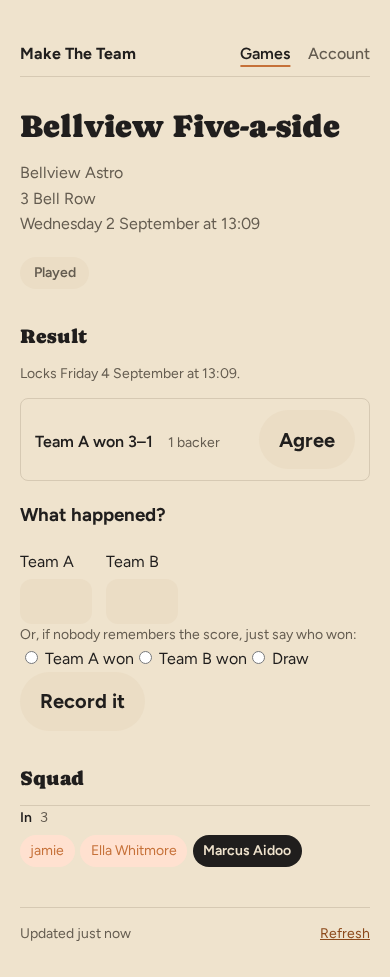
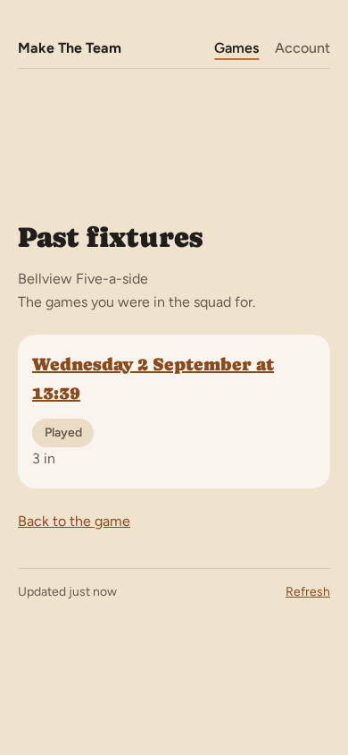

# Your own fixtures

Everything so far works from an email, and most weeks that's all anyone needs.
But if you'd rather look than wait — you've deleted the email, or you're not
sure whether you answered — you can sign in and see every game you're part of
in one place.

## Your fixtures

Signing in shows your fixtures as cards, nearest first.

Each card carries the same facts as the email: the Meadow Park Kickabout,
Meadow Park 3G, the date and 19:00. **Confirmed — the game is on** means enough
people have said yes. The bar under it fills as people answer, and the count
beneath it — **10 of 10 in · 2 waiting** — says every place is taken with two
more queued behind. **You're in** is your own answer.

The game's name at the top of the card is a link. Tap it to see that game on
its own — where it's played, who else is playing if the organiser shows that,
which side you're on once the teams have gone up, and the dates coming up.

Under the fixtures you can still answer, **Recently played** shows the last
game you were in, with the score once the squad has settled on it. Games
waiting on your own answer about what happened come first, under **Results
needed**; this is the one after that.

**I'm in** and **Can't make it** sit on the card, and you can use them whether
or not you've answered already. There's no email in the way here, so it's one
tap rather than two: tapping a button on the card saves your answer there and
then. It's the same answer, recorded the same way, as tapping one on the page
in chapter 3.

## Is this up to date?

Every one of these pages ends with a quiet line telling you when it was
loaded — **Updated just now**, and later **Updated 12 minutes ago** — with a
**Refresh** link beside it.

Most of the time you won't need the link. Come back to the app after a few
minutes away and it fetches the page again by itself, so what you're reading
is what's true now rather than what was true when you last looked. The one
time it leaves the page alone is when you're in the middle of something on
it — half way through picking the teams, say — because refreshing would throw
that away. Then the line is there to tell you the page is old, and the link is
there for when you're ready.

## Recording a result

Once a game's been played, anyone who was in it — and your organiser, whether
or not they played — can say what happened. Tap the fixture from your games
list or your account page and the result is the first thing on the page,
above the teams and the squad.

If you know the score, put it in and tap **Record it** — Make The Team works
out who won from the numbers, so you don't say both. If nobody remembers the
exact score, the three buttons underneath let you just say who won, or that it
was a draw.

Somebody else may have already said what they think happened. If you agree,
tap **Agree** on their claim rather than typing it again — the count next to
it goes up, so the squad can see how sure everyone is. If you remember it
differently, fill in the form with your own answer instead; both are shown,
each with its own backers, until enough of the squad has settled on one. Typed
something by mistake? **Withdraw my answer** takes your claim back off the
board.

Nothing is final straight away. The result locks two days after kick-off, so
there's time for the squad to agree on it — and if the fixture's teams were
never picked in the app, the locked result says so rather than guessing who
played on which side.

## Games you've already played

Every game has its own list of the fixtures it has already had. On a game's
page, **Games you've played** opens it: the ones you were in the squad for,
most recent first, each with the score once it settled. Tap any of them to
see that fixture in full — the teams, who played, and the result.

Your organiser sees more on the same page. Theirs is called **Past fixtures**
and holds every fixture the game has had, called-off ones included, so
"what happened to that Thursday?" has an answer rather than a gap.

## Your record

Under your fixtures, **Your record** counts how you've actually got on: one row
per game you've played in, with **P**, **W**, **L** and **D** — played, won,
lost, drawn — and, if you play in more than one, an **All games** row adding
them up. The game's name is a link to it.

A game counts as played whenever you were in for it. It counts as won, lost or
drawn only once a result settled *and* your organiser picked sides — without a
side there's nothing to say about how *you* got on, only how the fixture ended.
Where those two numbers differ you'll see a fifth column, **NR**, and a line
underneath explaining it: the games you played where nobody agreed a result, or
where sides were never picked. It appears only when there's something in it.

If you haven't played yet there's no section at all, rather than a table of
noughts.

## The squad's league table

On a game's page, **Standings** ranks everyone in the squad: a position, then
**P**, **W**, **L** and **D** as above, then **GD** for goal difference, **Win%**
and **Pts**. Three points for a win and one for a draw, the way a league table
works. Your own row is highlighted where it falls — it isn't moved to the top,
because a table with your name printed above people above you isn't a table any
more.

Players level on points, goal difference and wins share a position, and the next
position skips the places they used up — again, the way a league table works.
Nobody is put above anybody else on a tiebreak the table hasn't shown you.

Two of the columns are narrower than they look. **Win%** is worked out over the
games that settled, not everything played. **GD** counts only the games where a
score was actually agreed, so it covers fewer games than the rest of the row —
the note under the table says so.

On a narrow phone **Win%** is left out, so that the position column fits. Turn
the phone or open the page on something wider and it comes back. Nothing else
changes: **W**, **D**, **L** and **P** are all still on the row to work it out
from.

Whether you see the table at all follows the same setting as the squad list. If
your organiser has chosen to keep the squad private, there are no standings on
your page either — not an empty table, nothing at all.

## Signing in faster

Waiting for a sign-in email is fine once. If you look often, add a passkey.
If you have added Make The Team to your iPhone's home screen, add one now: an
emailed link opens in Safari and signs Safari in, not the app, so the passkey
is how you get back into the app itself. Sessions last 30 days of use, so
this only comes up after a month away.

A passkey signs you in with your phone or laptop's own fingerprint, face or
screen lock — no email, no waiting. Tap **Add a passkey**, and your device asks
you to confirm in the way you already recognise. This page tells you whether
you have one yet; here, nothing has been added.

Adding one changes nothing else. The emailed sign-in link keeps working, so if
you're on a borrowed computer or your phone is flat, you can still get in the
old way.

## Your account

There's a page for you as well as for your games. **Your account** — linked
from your games list — has your name on it, and changing it there changes it
everywhere: on every fixture your squad can see, and in every email that goes
out about you.

Your email address is on that page too, but you can't change it there. It's
how you sign in, so changing it isn't a matter of typing a new one — get it
wrong and the link that would put it right goes to somebody else's inbox. For
now, if you need a different address, sign up again with it and ask your
organiser to swap you over.

Underneath is everything you've played, most recent first, twenty fixtures
deep, across all your games rather than just one. If you've left a game, its
fixtures aren't in the list: the page shows you the squads you're in.

Further down the account page is an offer to add Make The Team to your home
screen, with instructions for your device. Installed, it opens straight to
your fixtures — no browser bar, no address to remember, just an icon like
any other app.

Below that is **Notifications**, where a supported device can be turned on
to get a push notification here instead of waiting for an email — a fixture
opening, a reminder, a place freeing up on the waitlist. Devices you've
turned this on for are listed underneath, each with its own **Remove**, so
you can turn a phone off without touching any of the others.

## When there's no connection

Fixtures change while you're not looking — who's in, how many places are
left, whether kickoff moved. So if you open the installed app with no signal,
it doesn't show you a guess from memory: it tells you there's no connection,
and lets you try again once you have one.

That's the whole product. Set the game up once, share one link, and let the
emails do the asking.
