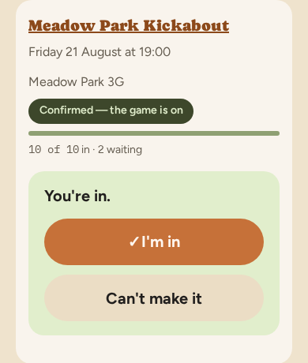
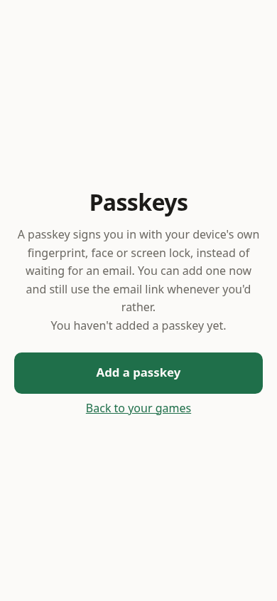
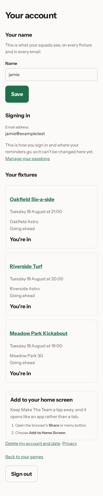
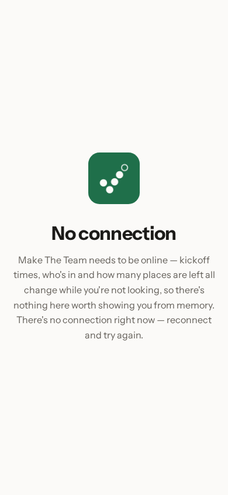

# Your own fixtures

Everything so far works from an email, and most weeks that's all anyone needs.
But if you'd rather look than wait — you've deleted the email, or you're not
sure whether you answered — you can sign in and see every game you're part of
in one place.

## Your fixtures

Signing in shows your fixtures as cards, nearest first.

Each card carries the same facts as the email: the Meadow Park Kickabout,
Meadow Park 3G, the date and 19:00. **Confirmed — the game is on** means enough
people have said yes. The bar under it fills as people answer, and the count
beneath it — **10 of 10 in · 2 waiting** — says every place is taken with two
more queued behind. **You're in** is your own answer.

The game's name at the top of the card is a link. Tap it to see that game on
its own — where it's played, who else is playing if the organiser shows that,
which side you're on once the teams have gone up, and the dates coming up.

**I'm in** and **Can't make it** sit on the card, and you can use them whether
or not you've answered already. There's no email in the way here, so it's one
tap rather than two: tapping a button on the card saves your answer there and
then. It's the same answer, recorded the same way, as tapping one on the page
in chapter 3.

## Signing in faster

Waiting for a sign-in email is fine once. If you look often, add a passkey.

A passkey signs you in with your phone or laptop's own fingerprint, face or
screen lock — no email, no waiting. Tap **Add a passkey**, and your device asks
you to confirm in the way you already recognise. This page tells you whether
you have one yet; here, nothing has been added.

Adding one changes nothing else. The emailed sign-in link keeps working, so if
you're on a borrowed computer or your phone is flat, you can still get in the
old way.

## Your account

There's a page for you as well as for your games. **Your account** — linked
from your games list — has your name on it, and changing it there changes it
everywhere: on every fixture your squad can see, and in every email that goes
out about you.

Your email address is on that page too, but you can't change it there. It's
how you sign in, so changing it isn't a matter of typing a new one — get it
wrong and the link that would put it right goes to somebody else's inbox. For
now, if you need a different address, sign up again with it and ask your
organiser to swap you over.

Underneath is everything you've played, most recent first, twenty fixtures
deep, across all your games rather than just one. If you've left a game, its
fixtures aren't in the list: the page shows you the squads you're in.

Further down the account page is an offer to add Make The Team to your home
screen, with instructions for your device. Installed, it opens straight to
your fixtures — no browser bar, no address to remember, just an icon like
any other app.

## When there's no connection

Fixtures change while you're not looking — who's in, how many places are
left, whether kickoff moved. So if you open the installed app with no signal,
it doesn't show you a guess from memory: it tells you there's no connection,
and lets you try again once you have one.

That's the whole product. Set the game up once, share one link, and let the
emails do the asking.
